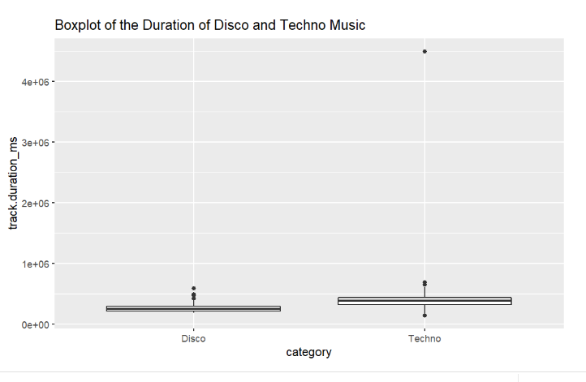

```{r setup, include=FALSE}
knitr::opts_chunk$set(echo = TRUE)
remotes::install_github("rstudio/bslib")
```

### Background

<b>Corpus</b>

The corpus I chose are two playlists I listen to often when I have a party. The first is a disco playlist and the second is a techno playlist. Even though I really like these two genres, they are very different from one another which makes them interesting to investigate. The disco playlist contains 82 songs and the techno playlist contains 444 songs. Both playlists are owned and created by the same person.

<b>Disco</b> 

Disco music is a genre that emerged in the seventies in the United States. It is a mixture of soul, funk and pop. The genre is typified by syncooated baselines, four-on-the-floor beats, string sections, synthesizers, horns, electric piano, and electric guitar ('Disco', 2022). Disco music typically has a tempo of approximately 120 beats per minute ('A Diversity of Sounds in Disco Music', 2004). The typical structure of a disco song, is a verse chorus structure with a bridge towards the end of the song. Usually the song ends with the chorus ('Elena's Music Genres in Context', 2022). Some famous disco artists are the Bee Gees, ABBA, and Earth, Wind & Fire. 

<b>Techno</b> 

Techno music is a form of electronic dance music. The genre originates from the 1980s in Detroit and Germany. The music is typified by a four-on-floor-beat, just like Disco, with a tempo that usually varies between 120 and 150 beats per minute. The music is generally produced on a DJ set, using electronic instruments ('Techno', 2022). Usually techno music does not contain a lot of vocals. The most common structure for techno/EDM music is an ABAB structure ('EDM Song Structure', 2022). The A sections denote the intro, breakdown and buildup sections of the song. The B sections are the sections that feature a 'drop'. This is a point in a music track where a sudden change of rhythm or bass line occurs, which is preceded by a build-up section and break ('Drop (music)', 2022).

<b>Typical songs</b> 

A typical song for the disco playlist is:
<i>Stayin' Alive - Bee Gees</i>

This is a typical disco song with a foor-on-the-floor beat. 

A typical song for the techno playlist is:
<i>Things we might have said - Reinier Zonneveld</i>

This is a typical techno song with a strong beat and repetitive nature. 

***
<iframe style="border-radius:12px" src="https://open.spotify.com/embed/playlist/1INPlxujcga9tSwvSF6jIw?utm_source=generator&theme=0" width="50%" height="380" frameBorder="0" allowfullscreen="" allow="autoplay; clipboard-write; encrypted-media; fullscreen; picture-in-picture"></iframe>

<iframe style="border-radius:12px" src="https://open.spotify.com/embed/playlist/1SVsb8xrG47T8hNTOFqRIm?utm_source=generator&theme=0" width="50%" height="380" frameBorder="0" allowfullscreen="" allow="autoplay; clipboard-write; encrypted-media; fullscreen; picture-in-picture"></iframe>

### <b>Danceability</b> and <b>Speechiness</b> of the Disco and Techno Genre


```{r echo=FALSE}
library(spotifyr)
library(plotly)
disco <- get_playlist_audio_features("", "1INPlxujcga9tSwvSF6jIw")
techno <- get_playlist_audio_features("", "1SVsb8xrG47T8hNTOFqRIm")
plot_disco <- ggplot(disco, aes(x=danceability, y=speechiness)) + geom_point(color = "#ADD8E6") + ggtitle('Danceability and speechiness of the Disco Playlist')
plot_techno <- ggplot(techno, aes(x=danceability, y=speechiness)) + geom_point(color = "pink") + ggtitle('Danceability and speechiness of the Techno Playlist')
plot_disco 
plot_techno
```


*** 
Here, the speechiness is plotted against the danceability of all songs in the disco and the techno playlist. 

<b>Danceability</b>

The danceability of the disco genre is quite high. Most songs in the corpus have a danceability of 0.6 or higher. This was expected, since disco is known as a genre that is very suited for dancing. Hence, the name 'disco' after the French word 'discothèque', which is a nightclub ('Disco', 2022). There are also several dance styles that were developed during the time that disco music was popular, such as 'the Husle'. 

The danceability of the techno genre is mostly between 0.5 and 0.85, which a little bit lower than the disco genre. It is still a considerable amount of danceability, which is not too surprising, because techno is a genre of electronic dance music ('Techno', 2022).

<b>Speechiness</b>

The speechiness for the disco genre is between 0.025 and 0.225. Most datapoints are concentrated around 0.05. This is a lot lower than I expected, because disco songs usually always contain some singing to a certain degree. However, disco music is certainly less speechy than rap music or some pop songs, due to the fact that there is also a lot of attention for the instrumental parts of the songs. That could be an explaination for the fact why the speechiness of the disco genre is quite low. 

For the techno genre, the speechiness is concentrated mostly around 0.1, which is close to no speechiness. But there are some outliers wich reach a speechiness of almost 0.45, which is pretty high for a techno song. Techno songs usually contain a little to no singing. I think that the speechiness spotify feature is not the most accurate feature, because I would have expected the speechiness of disco to be a lot higher than the speechiness of techno. Another explaination could be that the songs in the techno playlist that I used contain more singing/speech than typical techno songs. 


### <b>Tempo Analysis</b> of a Disco and Techno song

```{r, echo=FALSE}
library(spotifyr)
library(dplyr)
library(compmus)
library(plotly)
stayin_alive <- get_tidy_audio_analysis("6pyzBTIjcO2AMkKE6x2Otb")
stayin_alive %>%
  tempogram(window_size = 8, hop_size = 1, cyclic = TRUE) %>%
  ggplot(aes(x = time, y = bpm, fill = power)) +
  geom_raster() +
  scale_fill_viridis_c(guide = "none") +
  labs(x = "Time (s)", y = "Tempo (BPM)") +
  theme_classic() + scale_fill_viridis_c('tempo')
mistreated <- get_tidy_audio_analysis("5JTzJAz1QksP0iqKiL5bbd")
mistreated %>%
  tempogram(window_size = 8, hop_size = 1, cyclic = TRUE) %>%
  ggplot(aes(x = time, y = bpm, fill = power)) +
  geom_raster() +
  scale_fill_viridis_c(guide = "none") +
  labs(x = "Time (s)", y = "Tempo (BPM)") +
  theme_classic() + scale_fill_viridis_c('tempo')
techno_tempo <- get_playlist_audio_features("", "1SVsb8xrG47T8hNTOFqRIm")
disco_tempo <- get_playlist_audio_features("", "1INPlxujcga9tSwvSF6jIw")
tempo_analysis <-
  bind_rows(
    techno_tempo %>% mutate(category = "Techno"),
    disco_tempo %>% mutate(category = "Disco")
  )
tempo_analysis %>%
  ggplot(aes(x = category, y = tempo)) +
  geom_boxplot() + ggtitle('Boxplot of the Tempo of Disco and Techno Music')
```


*** 

<iframe style="border-radius:12px" src="https://open.spotify.com/embed/track/6pyzBTIjcO2AMkKE6x2Otb?utm_source=generator" width="50%" height="380" frameBorder="0" allowfullscreen="" allow="autoplay; clipboard-write; encrypted-media; fullscreen; picture-in-picture"></iframe>

<iframe style="border-radius:12px" src="https://open.spotify.com/embed/track/55FBE7EvGMTcLoVdqGstSX?utm_source=generator" width="50%" height="380" frameBorder="0" allowfullscreen="" allow="autoplay; clipboard-write; encrypted-media; fullscreen; picture-in-picture"></iframe>

<b>'Stayin' Alive' Tempo Analysis</b>

On the left, the first figure you see is the cyclic tempogram of the song: Stayin' Alive by the Bee Gees (disco song). I chose this song, because the rythm of this song is the same as the tempo that is used to conduct CPR. Furthermore, Stayin' alive rests on a 'four on the floor' beat, which is a really typical for disco songs ('Disco', 2022).    

As you can see by the horizontal line in the tempogram, the rythm of the song is very stable and does not change during the song, which is typical for disco songs ('Disco', 2022). The BPM is a little bit over 100. This is in line with the website: 'Tunebat', which states that the BPM of Stayin' alive by the Bee Gees is indeed a 104 BPM. 

<b>'Mistreated' Tempo Analysis</b>

The second tempogram is the cyclic tempogram of the song 'Mistreated' by Scott Diaz, which is a techno song. A typical tempo for techno songs is 120-125 BPM (Kody, 2021). This is in line with what is visible in the tempogram. There is a strong horizontal line around a 120 BMP, which is the beat of this song. This stays throughout the song, but it gets interrupted around 220 seconds. Here, the strong beat of the song stops and there is some singing in the song. That is why the tempogram does not show a clear beat in this area. 

The beat of the techno song is a little faster than the beat of the disco song, which is pretty typical becaues techno usually has a pretty fast beat. It is also quite typical for a techno song to not have the most steady beat, because often songs have drops or interruptions of the beat, just like in the song I featured in the second tempogram. For disco songs it is more common that the beat stays the same throughout the song. 

<b>General Tempo Analysis</b>

In the boxplot the overall tempo per genre is plotted. This plot confirms the tempo analysis of the two individual songs, in the sense that techno songs overall have a higher tempo than disco songs. The median of the tempo of disco music lies at 120 BMP, whereas the median of techno lies around 128 BMP.

### <b>Loudness</b> of the Disco and Techno Genre

```{r, echo=FALSE}
tempo_analysis %>%
  ggplot(aes(x = loudness)) +
  geom_histogram(binwidth = 0.1) +
  facet_wrap(~category) + ggtitle("Histogram of the Loudness of Disco and Techno Music")
tempo_analysis %>%
  ggplot(aes(x = category, y = loudness)) +
  geom_boxplot() + ggtitle('Boxplot of the Loudness of Disco and Techno Music')
```


***

Herer, I plotted two different visualizations of the loudness of the disco and techno genre. The first plot is is histogram. The histogram plots the loudness of all the songs in both cathegories. Loudness is always a negative number, and the more negative it is, the 'louder' the song. At first sight, it seems that the techno genre contains much louder songs than the disco genre, because the bars are a lot higher for techno music. 

On average though, and taking into account outliers, the loudness does not differ too much between the two genres. This is visible in the boxplot. The median of the loudness of the techno genre is equal to -8 and the median of disco music lies around -7.5. 

The overall difference in loudness between the two genres is not too big, but techno music is a little louder than disco music. Looking at the histogram, we can conclude that even though on average there is not a big difference between the two genres, the loudest songs are all in the techno genre. 


### Chordogram

```{r, echo=FALSE}
library(tidyverse)
library(spotifyr)
library(compmus)
library(dplyr)
circshift <- function(v, n) {
  if (n == 0) v else c(tail(v, n), head(v, -n))
}
#      C     C#    D     Eb    E     F     F#    G     Ab    A     Bb    B
major_chord <-
  c(   1,    0,    0,    0,    1,    0,    0,    1,    0,    0,    0,    0)
minor_chord <-
  c(   1,    0,    0,    1,    0,    0,    0,    1,    0,    0,    0,    0)
seventh_chord <-
  c(   1,    0,    0,    0,    1,    0,    0,    1,    0,    0,    1,    0)
major_key <-
  c(6.35, 2.23, 3.48, 2.33, 4.38, 4.09, 2.52, 5.19, 2.39, 3.66, 2.29, 2.88)
minor_key <-
  c(6.33, 2.68, 3.52, 5.38, 2.60, 3.53, 2.54, 4.75, 3.98, 2.69, 3.34, 3.17)
chord_templates <-
  tribble(
    ~name, ~template,
    "Gb:7", circshift(seventh_chord, 6),
    "Gb:maj", circshift(major_chord, 6),
    "Bb:min", circshift(minor_chord, 10),
    "Db:maj", circshift(major_chord, 1),
    "F:min", circshift(minor_chord, 5),
    "Ab:7", circshift(seventh_chord, 8),
    "Ab:maj", circshift(major_chord, 8),
    "C:min", circshift(minor_chord, 0),
    "Eb:7", circshift(seventh_chord, 3),
    "Eb:maj", circshift(major_chord, 3),
    "G:min", circshift(minor_chord, 7),
    "Bb:7", circshift(seventh_chord, 10),
    "Bb:maj", circshift(major_chord, 10),
    "D:min", circshift(minor_chord, 2),
    "F:7", circshift(seventh_chord, 5),
    "F:maj", circshift(major_chord, 5),
    "A:min", circshift(minor_chord, 9),
    "C:7", circshift(seventh_chord, 0),
    "C:maj", circshift(major_chord, 0),
    "E:min", circshift(minor_chord, 4),
    "G:7", circshift(seventh_chord, 7),
    "G:maj", circshift(major_chord, 7),
    "B:min", circshift(minor_chord, 11),
    "D:7", circshift(seventh_chord, 2),
    "D:maj", circshift(major_chord, 2),
    "F#:min", circshift(minor_chord, 6),
    "A:7", circshift(seventh_chord, 9),
    "A:maj", circshift(major_chord, 9),
    "C#:min", circshift(minor_chord, 1),
    "E:7", circshift(seventh_chord, 4),
    "E:maj", circshift(major_chord, 4),
    "G#:min", circshift(minor_chord, 8),
    "B:7", circshift(seventh_chord, 11),
    "B:maj", circshift(major_chord, 11),
    "D#:min", circshift(minor_chord, 3)
  )
key_templates <-
  tribble(
    ~name, ~template,
    "Gb:maj", circshift(major_key, 6),
    "Bb:min", circshift(minor_key, 10),
    "Db:maj", circshift(major_key, 1),
    "F:min", circshift(minor_key, 5),
    "Ab:maj", circshift(major_key, 8),
    "C:min", circshift(minor_key, 0),
    "Eb:maj", circshift(major_key, 3),
    "G:min", circshift(minor_key, 7),
    "Bb:maj", circshift(major_key, 10),
    "D:min", circshift(minor_key, 2),
    "F:maj", circshift(major_key, 5),
    "A:min", circshift(minor_key, 9),
    "C:maj", circshift(major_key, 0),
    "E:min", circshift(minor_key, 4),
    "G:maj", circshift(major_key, 7),
    "B:min", circshift(minor_key, 11),
    "D:maj", circshift(major_key, 2),
    "F#:min", circshift(minor_key, 6),
    "A:maj", circshift(major_key, 9),
    "C#:min", circshift(minor_key, 1),
    "E:maj", circshift(major_key, 4),
    "G#:min", circshift(minor_key, 8),
    "B:maj", circshift(major_key, 11),
    "D#:min", circshift(minor_key, 3)
  )
daddy_cool <-
  get_tidy_audio_analysis("3WMbD1OyfKuwWDWMNbPQ4g") %>%
  compmus_align(sections, segments) %>%
  select(sections) %>%
  unnest(sections) %>%
  mutate(
    pitches =
      map(segments,
        compmus_summarise, pitches,
        method = "mean", norm = "manhattan"
      )
  )
daddy_cool %>% 
  compmus_match_pitch_template(
    key_templates,         # Change to chord_templates if descired
    method = "euclidean",  # Try different distance metrics
    norm = "manhattan"     # Try different norms
  ) %>%
  ggplot(
    aes(x = start + duration / 2, width = duration, y = name, fill = d)
  ) +
  geom_tile() +
  scale_fill_viridis_c(guide = "none") +
  theme_minimal() +
  labs(x = "Time (s)", y = "") + ggtitle('Chordogram of Disco Song: Daddy Cool')
aftermath <-
  get_tidy_audio_analysis("1eRVsFpFd4NfHG2ll5QneP") %>%
  compmus_align(sections, segments) %>%
  select(sections) %>%
  unnest(sections) %>%
  mutate(
    pitches =
      map(segments,
        compmus_summarise, pitches,
        method = "mean", norm = "manhattan"
      )
  )
aftermath %>% 
  compmus_match_pitch_template(
    key_templates,         # Change to chord_templates if descired
    method = "euclidean",  # Try different distance metrics
    norm = "manhattan"     # Try different norms
  ) %>%
  ggplot(
    aes(x = start + duration / 2, width = duration, y = name, fill = d)
  ) +
  geom_tile() +
  scale_fill_viridis_c(guide = "none") +
  theme_minimal() +
  labs(x = "Time (s)", y = "") + ggtitle('Chordogram of Techno Song: the Aftermath')
```

***

<iframe style="border-radius:12px" src="https://open.spotify.com/embed/track/3WMbD1OyfKuwWDWMNbPQ4g?utm_source=generator" width="50%" height="380" frameBorder="0" allowfullscreen="" allow="autoplay; clipboard-write; encrypted-media; fullscreen; picture-in-picture"></iframe>

<iframe style="border-radius:12px" src="https://open.spotify.com/embed/track/1eRVsFpFd4NfHG2ll5QneP?utm_source=generator" width="50%" height="380" frameBorder="0" allowfullscreen="" allow="autoplay; clipboard-write; encrypted-media; fullscreen; picture-in-picture"></iframe>


On the left, you can see the chordograms of the disco song: 'Daddy Cool' and the techno song: 'the Aftermath'.

<b>Daddy Cool</b>

The chordogram for the song 'Daddy Cool' shows clear activity in Cmin, Fmin, Cmaj and Fmaj rows. From 150 seconds till around 170 seconds, there is a vertical yellow band, which implicates little to no activity in all rows. This is explained by the fact that there is some 'halt' in the song, where you hear some background music and you can hear a man talking. That is why the chordogram does not show activity for some particular chords in this part. 

<b>The Aftermath</b>

The chordogram of this techno song looks quite strange. It does not show activity in particular rows, like with the disco chordogram. All the rows show strong activity, except for a few parts of the song. From around 110 seconds until 160 seconds and from 260 till 300 seconds, there is little to no activity in all rows. This is explained by a strong drilling sound that covers most of the sound in those parts of the song. The rest of the song is almost nothing else apart from a strong beat, which explains the strong activity in all the rows of the chordogram. I think the software for creating a chordogram does not handle these type of songs that well, because there are no clear chords in these typical techno songs. 

<iframe style="border-radius:12px" src="https://open.spotify.com/embed/track/3WMbD1OyfKuwWDWMNbPQ4g?utm_source=generator&theme=0" width="100%" height="380" frameBorder="0" allowfullscreen="" allow="autoplay; clipboard-write; encrypted-media; fullscreen; picture-in-picture"></iframe>

<iframe style="border-radius:12px" src="https://open.spotify.com/embed/track/1eRVsFpFd4NfHG2ll5QneP?utm_source=generator&theme=0" width="100%" height="380" frameBorder="0" allowfullscreen="" allow="autoplay; clipboard-write; encrypted-media; fullscreen; picture-in-picture"></iframe>

### <b>Structural Analysis</b> for a Disco and Techno
```{r, echo=FALSE}
library(tidyverse)
library(spotifyr)
library(compmus)
```
```{r, echo=FALSE}
survive <-
  get_tidy_audio_analysis("5FM2zyvBsSQtx9HXZ8dFsc") %>% # Change URI.
  compmus_align(bars, segments) %>%                     # Change `bars`
  select(bars) %>%                                      #   in all three
  unnest(bars) %>%                                      #   of these lines.
  mutate(
    pitches =
      map(segments,
        compmus_summarise, pitches,
        method = "rms", norm = "euclidean"              # Change summary & norm.
      )
  ) %>%
  mutate(
    timbre =
      map(segments,
        compmus_summarise, timbre,
        method = "rms", norm = "euclidean"              # Change summary & norm.
      )
  )
survive %>%
  compmus_self_similarity(timbre, "euclidean") %>% 
  ggplot(
    aes(
      x = xstart + xduration / 2,
      width = xduration,
      y = ystart + yduration / 2,
      height = yduration,
      fill = d
    )
  ) +
  geom_tile() +
  coord_fixed() +
  scale_fill_viridis_c(guide = "none") +
  theme_classic() +
  labs(x = "", y = "") + ggtitle('Self Similarity Matrix of Timbre of I Will Survive')
perpetual <-
  get_tidy_audio_analysis("1KLMFEi6H0DMVzIz4CYc4Z") %>% # Change URI.
  compmus_align(bars, segments) %>%                     # Change `bars`
  select(bars) %>%                                      #   in all three
  unnest(bars) %>%                                      #   of these lines.
  mutate(
    pitches =
      map(segments,
        compmus_summarise, pitches,
        method = "rms", norm = "euclidean"              # Change summary & norm.
      )
  ) %>%
  mutate(
    timbre =
      map(segments,
        compmus_summarise, timbre,
        method = "rms", norm = "euclidean"              # Change summary & norm.
      )
  )
perpetual %>%
  compmus_self_similarity(timbre, "euclidean") %>% 
  ggplot(
    aes(
      x = xstart + xduration / 2,
      width = xduration,
      y = ystart + yduration / 2,
      height = yduration,
      fill = d
    )
  ) +
  geom_tile() +
  coord_fixed() +
  scale_fill_viridis_c(guide = "none") +
  theme_classic() +
  labs(x = "", y = "") + ggtitle('Self Similarity Matrix of Timbre of Perpetual Groove')
```

***
<iframe style="border-radius:12px" src="https://open.spotify.com/embed/track/5FM2zyvBsSQtx9HXZ8dFsc?utm_source=generator" width="50%" height="380" frameBorder="0" allowfullscreen="" allow="autoplay; clipboard-write; encrypted-media; fullscreen; picture-in-picture"></iframe>

<iframe style="border-radius:12px" src="https://open.spotify.com/embed/track/1KLMFEi6H0DMVzIz4CYc4Z?utm_source=generator" width="50%" height="380" frameBorder="0" allowfullscreen="" allow="autoplay; clipboard-write; encrypted-media; fullscreen; picture-in-picture"></iframe>

<b>Self Similarity Matrix of 'I Will Survive'</b>

On left you can see the self similarity matrix of the song 'I Will Survive' by Gloria Gaynor. This is a very famous disco song. The dark blue parts of the plot represent similar parts in the song. The diagonal of the self similarity is very dark blue, which makes sense because this is where the self similarity matrix compares the same parts of the song, which of course are very similar. 

In the plot, there are some similar, darker chunks. From 40-70 seconds, 120-150 seconds and one from 170 seconds untill the end. These chunks represent the chorus of the song. Since the chorus is always the same, it is expected that these would show up on the self similarity matrix. 

In between these dark chunks, there are some lighter parts as well. For example, around 75 seconds there is a small yellow chunk. In this part of the song there is just some instrumental music playing, which is not very similar to the rest of the song, which is why it is lit up on the plot. Another example is around 110 seconds. This is a verse in the song. Verses are also always a little different from one another, which explains why it is lighter in the self similarity matrix. 

In short, the self similarity matrix clearly shows the verse-chorus structure of this song, which is a typical structure for the disco genre. 

<b>Self Similarity Matrix of 'Perpetual Groove'</b>

The second self similarity matrix is the one of 'Perpetual Groove' by Roog and Leon Benesty. This is a techno song. There is very high similarity at the beginning of the song and at the end. This is because at the beginning and at the end of the song, there is just a very strong, repetitive beat without anything else. 

There is very low similarity from around 170 till 205 seconds. Here you hear some trumpet-like sounds and a man voice how repeatedly says: 'Don't stop'. This is a buildup to a drop and not very similar to other parts in the song. Then the drop hits around 205 seconds, and the music becomes more similar. After the drop the trumpet sounds stay, but the repetative beat as in the beginning is back. That is why it is pretty similar but not as similar as the beginning and end of the song. This pattern is also visible from around 90 till 120 seconds. 

the self similarity matrix shows a strong ABAB structure. The A parts are the intro (which is very similar), and the buildups (which have very low similarity). The B parts are the drops, which follow the buildup pieces from 90-120 seconds and 170-205 seconds. This is a very typical structure for techno music. 

### Dendograms


```{r, figures-side, fig.show="hold", out.width="33%", echo=FALSE}
library(knitr)
# All defaults



```


*** 


I used K-nearest neighbour classification to classify whether a song belonged to the disco genre or the techno genre. My model has a precicion of 0.905 for the disco genre, and 0.947 for the techno genre, which is pretty high. This means that most songs that belong to the disco genre were classified as disco and most techno songs were classified as techno.

I also used decision trees as a classification algorithm. The advantage of decision trees is that it tells you what features played a big part in the classification decision. On the left I have plotted which features were important for classifying a song as either disco or techno. 
As you can see, the most important feature was 'acousticness'. This makes a lot of sense, because techno music is produces by mostly electronic instruments, and is probably the least acoustic musical genre there is. So when a song has high acousticness, the chance is quite high that it is a disco song. 

Valence was also an important feature for decision making. Valence represents the musical positiveness conveyed. This also does not come as a surprise to me, because disco music mostly is very positive and happy music, whereas techno can sometimes be quite 'dark'. Instrumentalness was also an important feature. This makes sense for the same reason as the reason why acousticness was an important feature. 
The fact that duration was also an important feature can be explained by the fact that techno songs are often very long. This is also visible in the boxplot, which shows that techno music has a longer duration than disco music. 

### Chroma Analysis of a disco and techno song

```{r, eval = FALSE, echo=FALSE}
remotes::install_github('jaburgoyne/compmus')
```

```{r echo=FALSE}
library(tidyverse)
library(spotifyr)
library(compmus)
voulez_vous <-
  get_tidy_audio_analysis("0ayyT5zbXqlXEQWoa0JggL") %>%
  select(segments) %>%
  unnest(segments) %>%
  select(start, duration, pitches)
techno_chrom <-
  get_tidy_audio_analysis("3P87vLHg7L6xGrnxQ5qpGL") %>%
  select(segments) %>%
  unnest(segments) %>%
  select(start, duration, pitches)
```

```{r echo=FALSE}
techno_chrom %>%
  mutate(pitches = map(pitches, compmus_normalise, "euclidean")) %>%
  compmus_gather_chroma() %>% 
  ggplot(
    aes(
      x = start + duration / 2,
      width = duration,
      y = pitch_class,
      fill = value
    )
  ) +
  geom_tile() +
  labs(x = "Time (s)", y = NULL, fill = "Magnitude") +
  theme_minimal() +
  scale_fill_viridis_c() + ggtitle('Chromagram of the Techno Song: Things We Might Have Said')
voulez_vous %>%
  mutate(pitches = map(pitches, compmus_normalise, "euclidean")) %>%
  compmus_gather_chroma() %>% 
  ggplot(
    aes(
      x = start + duration / 2,
      width = duration,
      y = pitch_class,
      fill = value
    )
  ) +
  geom_tile() +
  labs(x = "Time (s)", y = NULL, fill = "Magnitude") +
  theme_minimal() +
  scale_fill_viridis_c() + ggtitle('Chordogram of the Disco Song: Voulez-Vous')
```


***

<iframe style="border-radius:12px" src="https://open.spotify.com/embed/track/3P87vLHg7L6xGrnxQ5qpGL?utm_source=generator" width="50%" height="380" frameBorder="0" allowfullscreen="" allow="autoplay; clipboard-write; encrypted-media; fullscreen; picture-in-picture"></iframe>

<iframe style="border-radius:12px" src="https://open.spotify.com/embed/track/0ayyT5zbXqlXEQWoa0JggL?utm_source=generator" width="50%" height="380" frameBorder="0" allowfullscreen="" allow="autoplay; clipboard-write; encrypted-media; fullscreen; picture-in-picture"></iframe>

<b>Chroma Analysis of 'Things we might have said'</b>

On the left, you can see the chromagram of the song: Things we might have said by Reinier Zonneveld. The most part of the song is a repetative beat, which is represented by the many lines in the D, C# and C column. However, this repetition is interrupted two times (200 seconds and 350 seconds). You can see this in the D and C# column. The repetative beat is interrupted and there is a short buildup to a so called: 'drop'. This is a point in a music track where a sudden change of rhythm or bass line occurs, which is preceded by a build-up section and break ('Drop (music)', 2022). After this interruption, the beat picks up again as you can see by the lines in the chromagram. 

When the D and C# column show litte to no activity, the G# and D# columns lights up. This is because in those interruptions there is a woman singing. This is represented in the G# and D# columns of the chromagram. 

<b>Chroma Analysis of 'Voulez-Vous'</b>

The second chromagram you see is the chromagram of the song: 'Voulez-Vous' by ABBA. As you can see, throughout the whole song there is a lot of activity in the B- and E-rows. However, there are some interruptions of this activity, during which the activity in other rows picks up. For example, around 50 seconds, there is less activity in the B-row, and the A- and G- rows light up. This is no coincidence, because this is where the chorus of the song is. This pattern repeats itself (e.g. around 150 seconds), which makes sense, since the chorus also repeats itself. 

Another interesting thing to notice in the chromagram are the small bars in the B- and A- row that alternate in activity from around 210 seconds up until the end. This is because from that moment until the end of the song, all you hear is the instrumental music, alternated by a 'Aha' of the singers. The 'Aha' is what explains the activity in the A-row and the instrumental music is denoted by the activity in the B-row. In the end there is also one more chorus, which you can see by the activity in the A- and G-rows. 

### Conclusion

In this portfolio I examined various different features of the spotify API to look into the differences between disco and techno music. Here I will discuss these features and conclude what the differences are between the two genres. 

<b>Speechiness and Danceability</b>
The danceability of the disco genre was a little bit higher than the danceability of the techno genre. However, the speechiness of the techno genre was higher than the one of the disco genre. This was surprising, because usually techno does not contain a lot of vocals. 

<b>Tempo</b> 
One of the features I looked into is tempo. My results showed that the techno genre had a higher tempo than the disco genre. The techno genre had a tempo of around 128 BPM and disco around 120BPM. 

<b>Loudness</b>
The loudness of the two genres did not differ much. The median of the techno genre was -8 and the disco median was -7.5. However, the songs with the highest loudness were all belonged to the techno genre. 

<b>Structure</b>
After analysing self similarity matrices and chordograms of songs of both genres, I can conclude that disco songs clearly have a verse-chorus structure, whereas techno songs ususally follow an ABAB structure. 

<b>Other charecteristics</b>
After performing classification algorithms, I found some important features that are characteristics for each genre. Acousticness, valence, and instrumentalness is a lot higher in disco music than in techno music. Duration is higher in techno music. 

### References

A Diverity of Sounds in Disco Music.(2004). Retrieved March 30, from http://www.discosavvy.com/diversesounds.html#:~:text=The%20basic%20tempo%20of%20disco,the%20gaps%20between%20the%20beats. 

Disco. (2022). Retrieved March 23, 2022 from https://en.wikipedia.org/wiki/Disco#:~:text=Disco%20is%20a%20genre%20of,synthesizers%2C%20and%20electric%20rhythm%20guitars.

Drop (music). (2022). Retrieved March 18, 2022 from https://en.wikipedia.org/wiki/Drop_(music)

EDM Song Structure: Turn Your Loop Into A Song! Retrieved March 30, from https://cymatics.fm/blogs/production/edm-song-structure#:~:text=One%20of%20the%20most%20common,B%20would%20be%20the%20drop. 

Elena's Music Genres in Context. Retrieved March 30, from https://sites.google.com/site/elenasgenres/home/disco-extracts/disci-influences/disco-practitioners/disco-characteristics 

Kody, A. (2021, 27 oktober). Using Different Tempos to Make Beats for Different Genres. Izotope. Geraadpleegd op 23 maart 2022, van https://www.izotope.com/en/learn/using-different-tempos-to-make-beats-for-different-genres.html

Techno. (2022). Retrieved March 23, from https://en.wikipedia.org/wiki/Techno